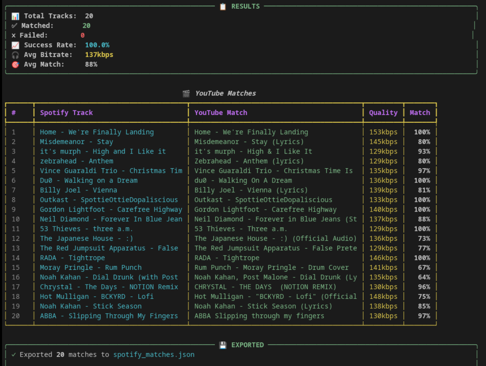

# SpotifyToYouTube

A CLI tool that fetches your Spotify liked songs and finds the highest quality YouTube matches for downloading.



## Features

- Fetch your Spotify liked songs via OAuth
- Find matching YouTube videos using yt-dlp
- Quality-first matching algorithm (prioritizes audio bitrate)
- Parallel searching for fast results
- Export to M3U, JSON, CSV, or TXT formats
- Built-in download command with yt-dlp integration
- Result caching for instant repeat runs
- Interactive wizard mode for easy setup

## Installation

### Prerequisites

- Python 3.11+
- [yt-dlp](https://github.com/yt-dlp/yt-dlp)
- [ffmpeg](https://ffmpeg.org/) (for MP3 conversion)

```bash
# Clone the repository
git clone https://github.com/yourusername/spotifytoyoutube.git
cd spotifytoyoutube

# Create virtual environment
python3 -m venv .venv
source .venv/bin/activate

# Install the package
pip install -e .

# Install ffmpeg (Ubuntu/Debian)
sudo apt install ffmpeg
```

### Spotify API Setup

1. Go to [Spotify Developer Dashboard](https://developer.spotify.com/dashboard)
2. Create a new application
3. Add `http://127.0.0.1:8888/callback` to Redirect URIs
4. Copy your Client ID and Client Secret

```bash
export SPOTIFY_CLIENT_ID="your_client_id"
export SPOTIFY_CLIENT_SECRET="your_client_secret"
```

## Usage

### Interactive Mode (Recommended)

Just run the command with no arguments for a guided experience:

```bash
# Match songs interactively
spotifytoyoutube

# Download songs interactively
spotifytoyoutube download
```

### Command Line

```bash
# Authenticate with Spotify
spotifytoyoutube auth

# Fetch your liked songs
spotifytoyoutube fetch --limit 100

# Find YouTube matches
spotifytoyoutube match --limit 50 --fast --verbose

# Export to playlist file
spotifytoyoutube match --limit 50 --fast -o playlist.txt

# Download directly
spotifytoyoutube download --limit 20 -o ~/Music/Spotify

# Clear cached results
spotifytoyoutube clear-cache
```

### Options

#### `match` command
| Option | Description |
|--------|-------------|
| `-l, --limit` | Number of songs to match |
| `-o, --output` | Export file (supports .txt, .m3u, .json, .csv) |
| `-f, --fast` | Enable parallel searching |
| `-w, --workers` | Number of parallel workers (default: 8) |
| `-v, --verbose` | Show detailed progress |
| `--no-cache` | Disable result caching |

#### `download` command
| Option | Description |
|--------|-------------|
| `-i, --input` | Input playlist file (.txt or .m3u) |
| `-o, --output-dir` | Download directory (default: ~/Music/SpotifyDownloads) |
| `-f, --format` | Audio format: mp3, opus, m4a, wav |
| `-l, --limit` | Songs to match if no input file |

## How It Works

1. **Authentication**: OAuth flow with Spotify to access your liked songs
2. **Fetching**: Retrieves track metadata (name, artist, album, duration)
3. **Searching**: Queries YouTube via yt-dlp for each track
4. **Matching**: Scores candidates by:
   - Audio bitrate (60% weight)
   - Title similarity (30% weight)
   - Duration match (10% weight)
5. **Exporting**: Saves URLs in your preferred format
6. **Downloading**: Uses yt-dlp to download and convert audio

## Development

```bash
# Install dev dependencies
pip install -e ".[dev]"

# Run tests
pytest

# Run linter
ruff check src/

# Run with coverage
pytest --cov=spotifytoyoutube
```

## License

MIT
